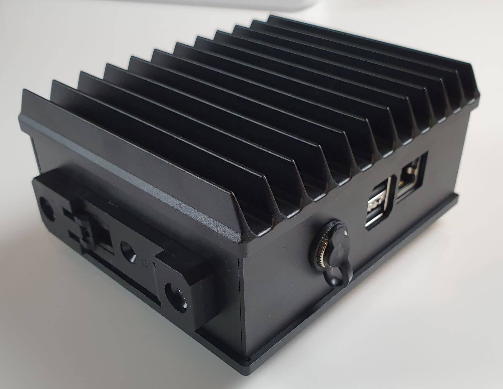
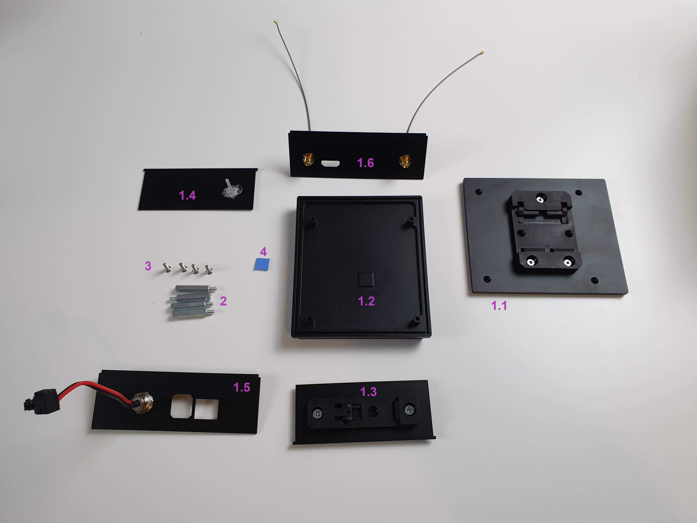
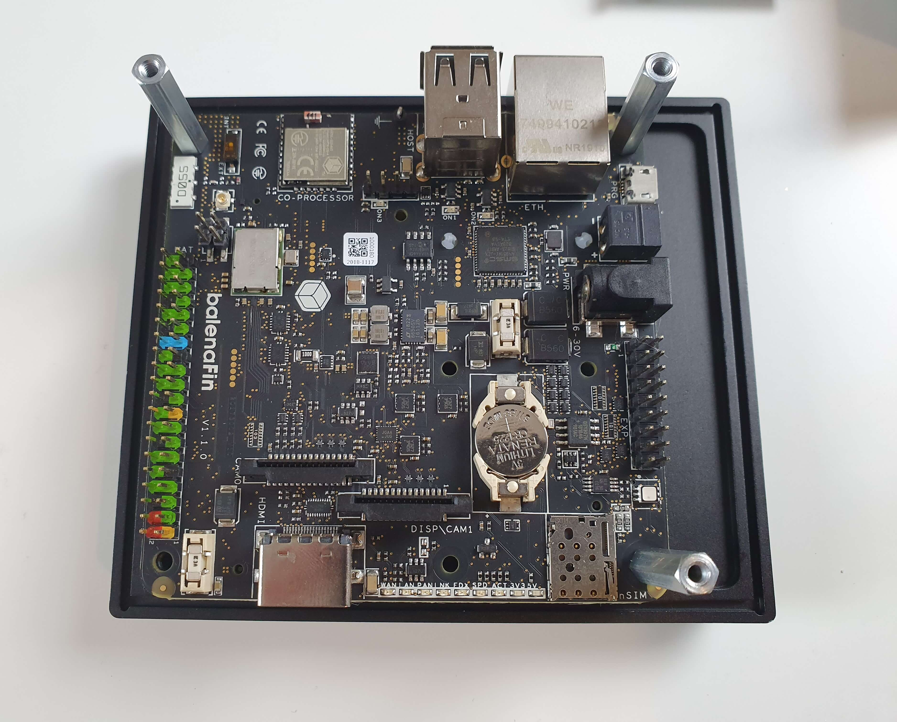
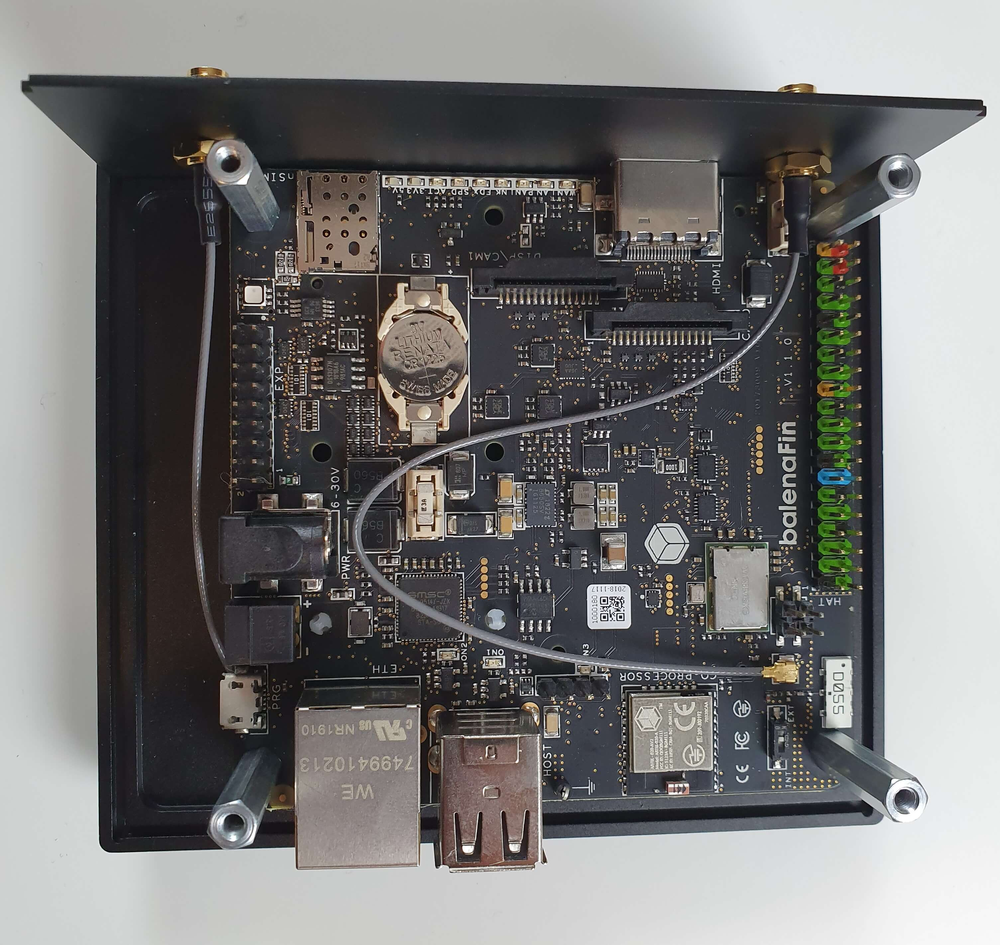
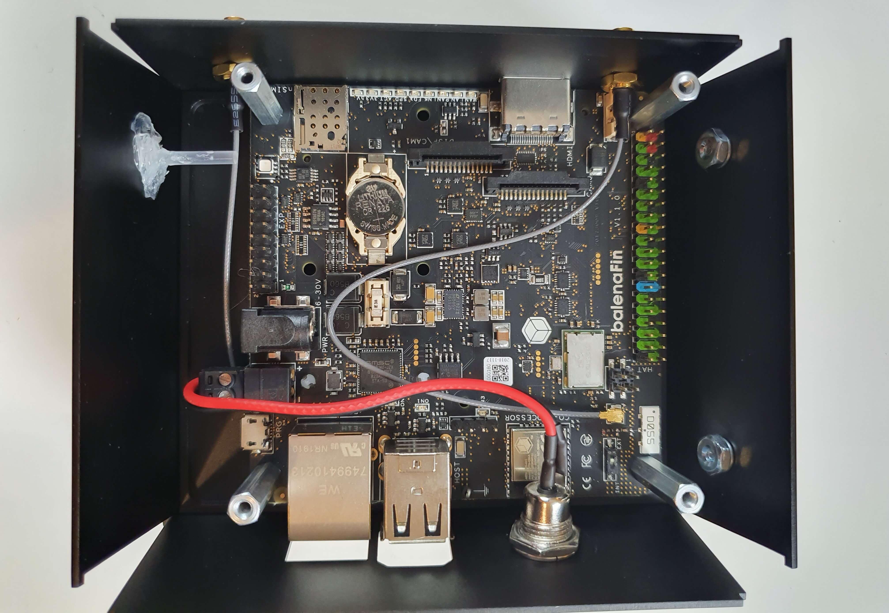
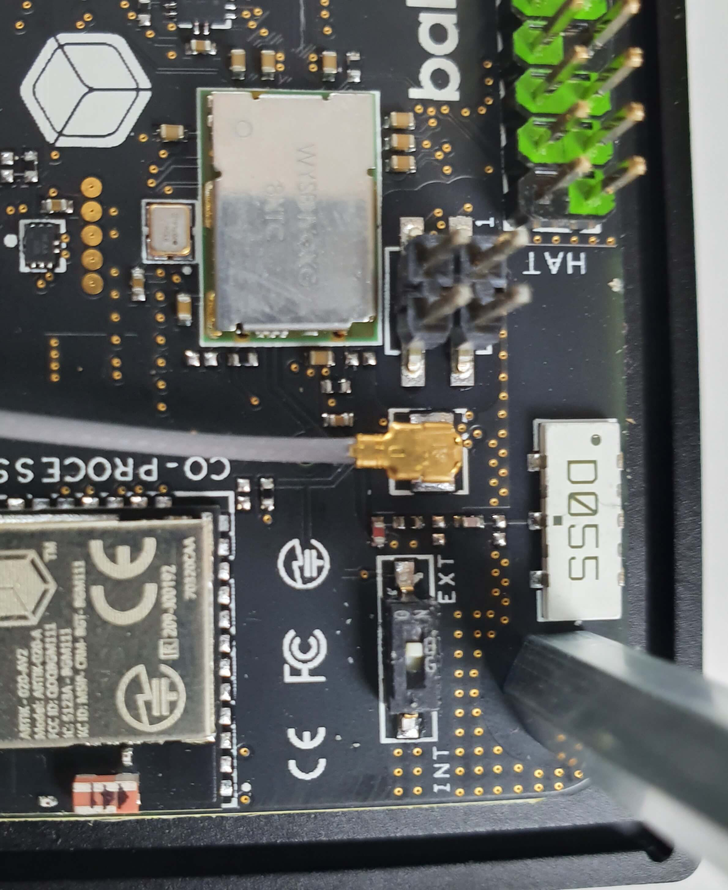
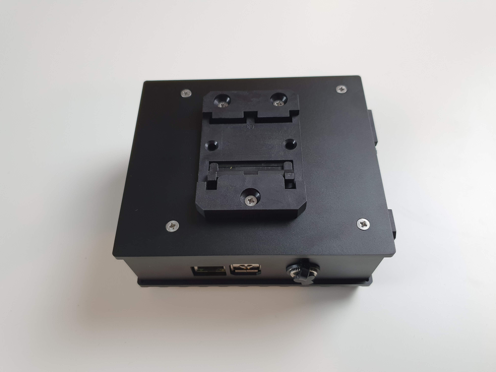

| **Document Type** | User Guide |
| --- | --- |
| **Product ID:** | TBD |
| **Product Name** | Modular DIN-rail Case |
| **Document Version** | 0.0.1 |
| **Author** | Carlo Maria Curinga |
| **State (Draft/Proposed/Approved)** | Draft |

## Revision history

| **Date (dd/mm/yyyy)** | **Version** | **Author** | **Description** |
| --- | --- | --- | --- |
| 14/01/2020 | 0.0.1 | Carlo Maria Curinga | First release |

# 1. Introduction

The Aluminium case is the official "heavy duty" case for the balenaFin. It exposes the following ports to the outside :

- 2 x USB
- Ethernet (RJ45)
- HDMI
- Barrel jack power connector
- 2 x External antenna mounting points

# 2. What's in the box?

1. Aluminium Case for balenaFin  
    1.1 - bottom  
    1.2 - Lid  
    1.3 - left side  
    1.4 - right side
    1.5 - front side
    1.6 - rear side
2. M3 standoffs
3. M3 screws
4. 10mm x 10mm thermal pad

# 3. Assembly instructions

## 3.1 Attaching the balenaFin

**Items needed**
- balenaFin board
- 4 x M3 standoffs (3 if HAT is mounted)
- Case Lid
- 10mm x 10mm thermal pad

**Instructions**
- Place the bottom part of the case on the table with the inside facing upwards.
- Locate the Compute Module thermal dissipation point of contact. It's a small square protruding.
- Remove the protective layer from the 10mm x 10mm thermal pad (4) and apply it to the Compute Module thermal disipation point of contact, then remove the other protective layer from it
- position the balenaFin so that the 2-POS phoenix input faces the side with more area
- If your balenaFin has a cellular or radio modem mounted on the mPCIe socket, connect to it one of the antenna connectors uFL from the rear side (1.6) before proceeding to the next step
- screw in the 4 standoffs. (If you plan to add a HAT, only screw in 3 leaving the closes hole to the HAT header free)

## 3.2 Assembling the other sides

**Items needed**
- Assembly from step 3.1
- Case sides

**Instructions**
- Each side has either a small protrusion or a dent on the top sides. Place them so that these face upwards. Make sure the light pipe from the right side aligns with the RGB LED on the balenaFin.
- Connect the pre-assembled DC Panel Power Jack to the balenaFin.
- Connect the one of the antenna connectors uFL from the rear side (1.6) and flip the antenna selector to `EXT` before proceeding to the next step

## 3.3  Final assembly

**Items needed**
- Assembly from step 3.2
- Case bottom
- 4 x M3 screws

**Instructions**
- Place the bottom on top of the assembly from step 3.2
- Secure the assembly with the 4 M3 screws

