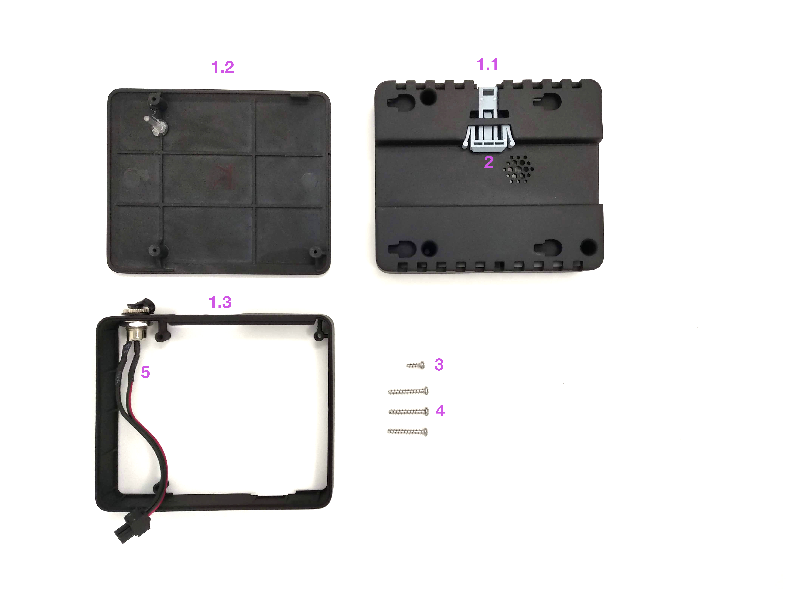
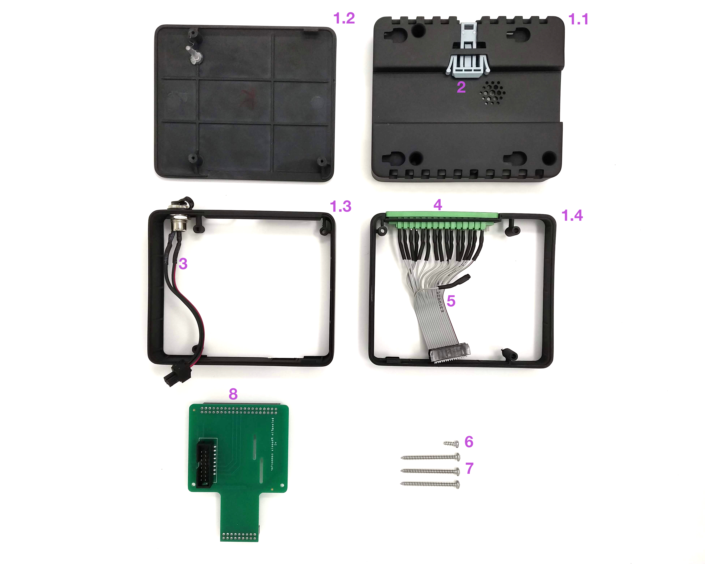
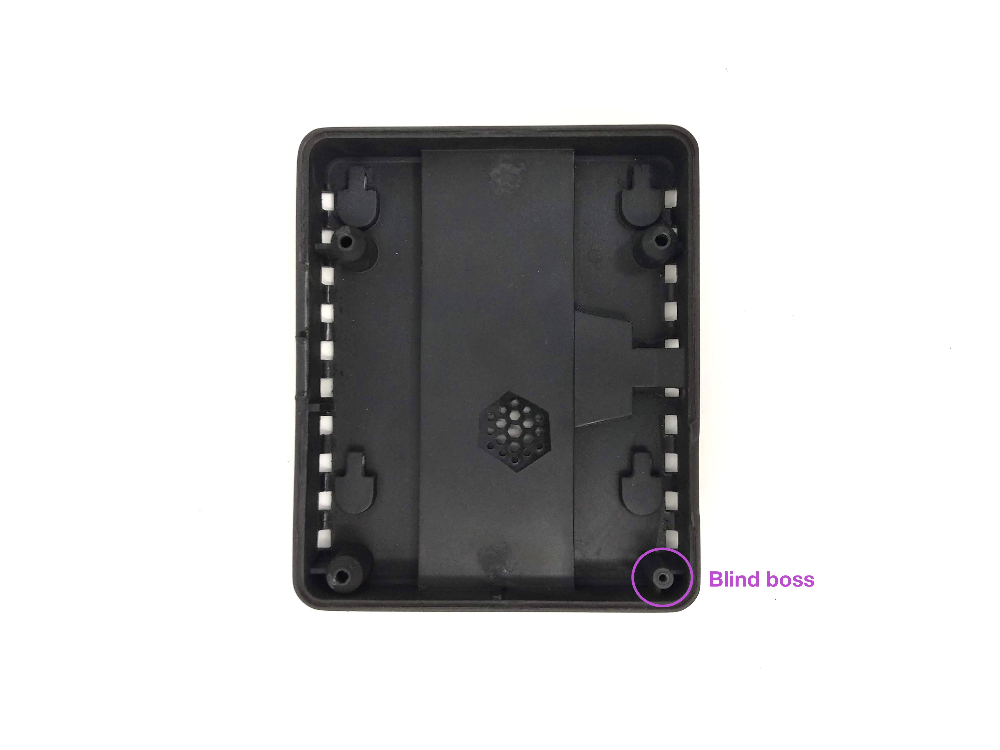
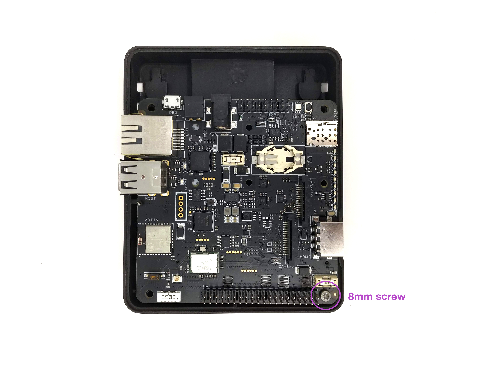
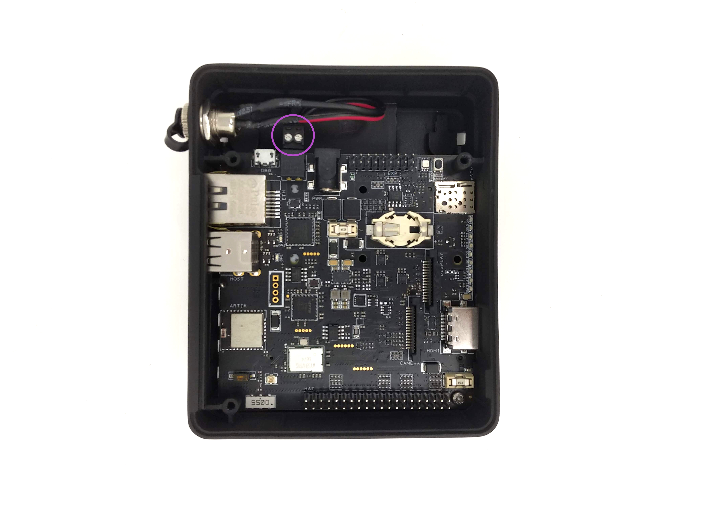
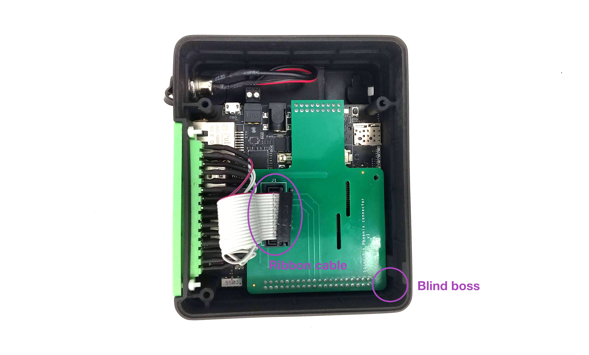
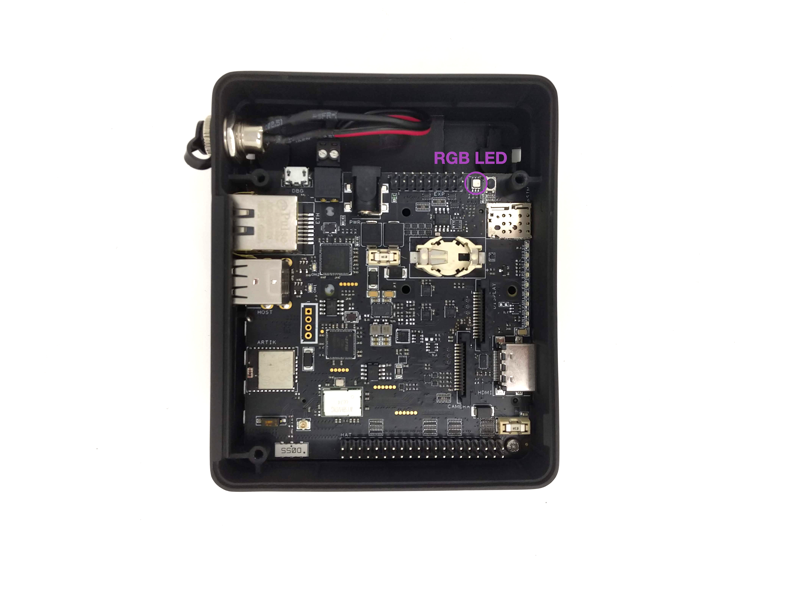
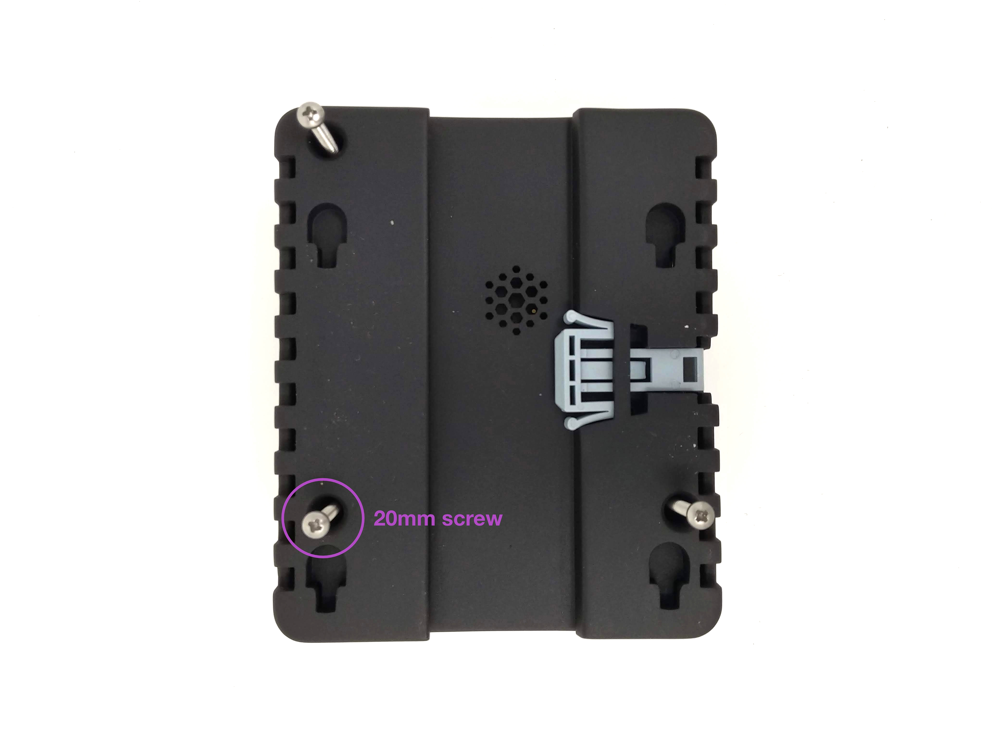
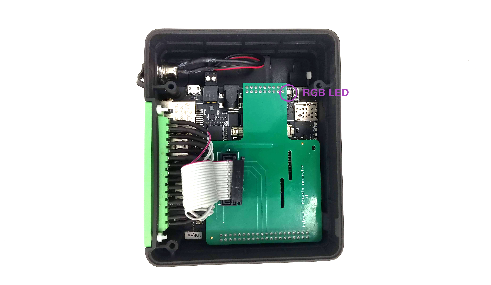

| **Document Type** | User Guide |
| --- | --- |
| **Product ID:** | FIN00028 (v2) |
| **Product Name** | Modular DIN-rail Case |
| **Document Version** | 0.0.1 |
| **Author** | Nicolas Tzovanis |
| **State (Draft/Proposed/Approved)** | Draft |

## Revision history

| **Date (dd/mm/yyyy)** | **Version** | **Author** | **Description** |
| --- | --- | --- | --- |
| 08/02/2019 | 0.0.1 | Nicolas Tzovanis | First release |

# 1. Introduction

The modular DIN-rail case is the official case for the balenaFin. It exposes mosts ports to the outside through panel mount connectors. The modular ring-based design of the case allows the use of Hardware Attached on Top (HAT) modules without the need of designing a case from scratch.
In order to expose most of the balenaFin internal ports, we designed two versions of the case:

### Standard version

This version exposes the basic balenaFin ports:
- 2 x USB
- Ethernet (RJ45)
- HDMI
- Barrel jack power connector
- 2 x External antenna mounting points

### Phoenix Ring version

In addition to the standard version, the Phoenix ring version has a second ring with a 15 position phoenix connector that exposes pins from the balenaFin HAT connectos and from the balenaFin co-processor. See the datasheet for the pinout. 

Both versions provide DIN-rail and VESA mounting on the bottom of the case.

# 2. What's in the box?

## 2.1 No phoenix ring version

1. Modular DIN-rail Case for balenaFin  
    1.1 - Bottom  
    1.2 - Lid  
    1.3 - balenaFin ring  
2. Din rail clip
3. M3x8mm self-tapping screw
4. 3 x M3x20mm self-tapping screws
5. DC-099 5.5 x 2.1mm DC Power Jack panel mount

## 2.2 Phoenix ring version

1. Modular DIN-rail Case for balenaFin  
    1.1 Bottom  
    1.2 Lid  
    1.3 balenaFin ring  
    1.4 Phoenix ring 
2. Din rail clip
3. DC-099 5.5 x 2.1mm DC Power Jack panel mount
4. 15-POS female phoenix panel mount
5. 15-POS ribbon cable
6. M3x8mm self-tapping screw
7. 3 x M3x20mm self-tapping screws
8. Phoenix ring HAT board

# 3. Assembly instructions

## 3.1 Attaching the balenaFin 

**Items needed**
- balenaFin board
- M3 x 8mm screw
- Case bottom

**Instructions**
- Place the bottom part of the case on the table.
- Locate the blind boss. It's the hole with the thinest plastic walls.

- Place the balenaFin (compute module facing down) so that the hole closest to the HAT header aligns with the blind boss.
- Use the M3 x 8mm screw to fix the balenaFin to the case in the blind boss.

Note: make sure the balenaFin is properly secure without overtighetning the screw to avoid breaking the plastic boss.

## 3.2 Assembling the rings

**Items needed**
- Assembly from step 3.1
- balenaFin ring
- Phoenix ring (only if assembling the phoenix ring version)
- Phoenix ring HAT board

**Instructions**
- Place the balenaFin ring on top of the assembly from step 3.1. Make sure the openings align and the missing boss of the ring aligns with the blind boss from step 3.1
- Connect the pre-assembled DC Panel Power Jack to the balenaFin.

_If not using phoenix ring version, skip to 3.3_
- Connect the Phoenix ring HAT board to the balenaFin.
- Place the phoenix ring on top, making sure the missing boss of the ring aligns with the missing boss from the balenaFin ring.
- Connect the 15-POS ribbon cable to the phoenix ring HAT board.

## 3.3  Final assembly

**Items needed**
- Assembly from step 3.2
- Case lid
- 3 x M3x20mm self-tapping screws
- 3 x M3x38mm self-tapping screws (only if assembling the phoenix ring version)

### 3.3.1 Instructions for standard version

- Place the lid on top of the assembly from step 3.2. Make sure the light pipe from the lid aligns with the RGB LED on the balenaFin.

- Flip the whole assembly upside down to expose the bottom part of the case.
- Secure the assembly with the M3x20mm self-tapping screws.

### 3.3.2 Instructions for phoenix version

- Place the lid on top of the assembly from step 3.2. Make sure the light pipe from the lid aligns with the RGB LED on the balenaFin.

- Flip the whole assembly upside down to expose the bottom part of the case.\
- Secure the assembly with the M3x38mm self-tapping screws.

