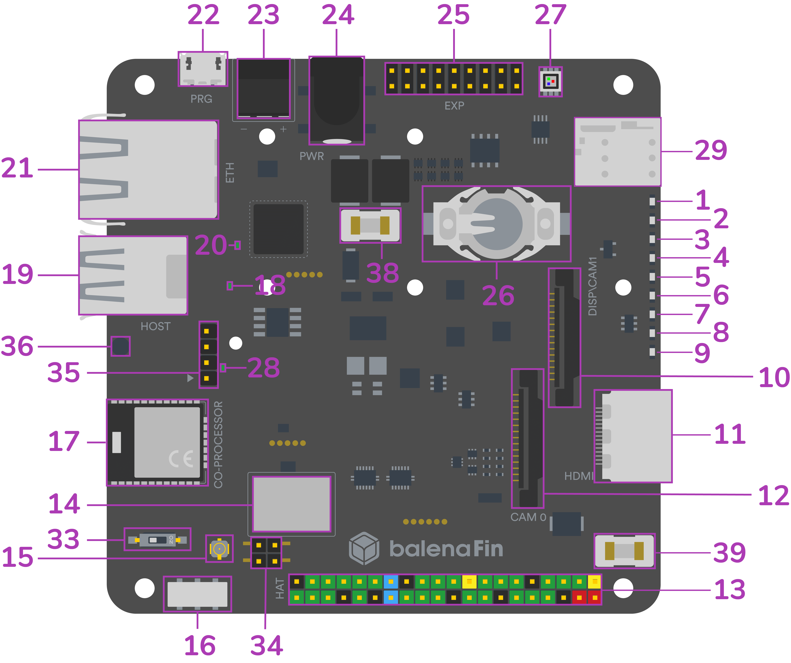
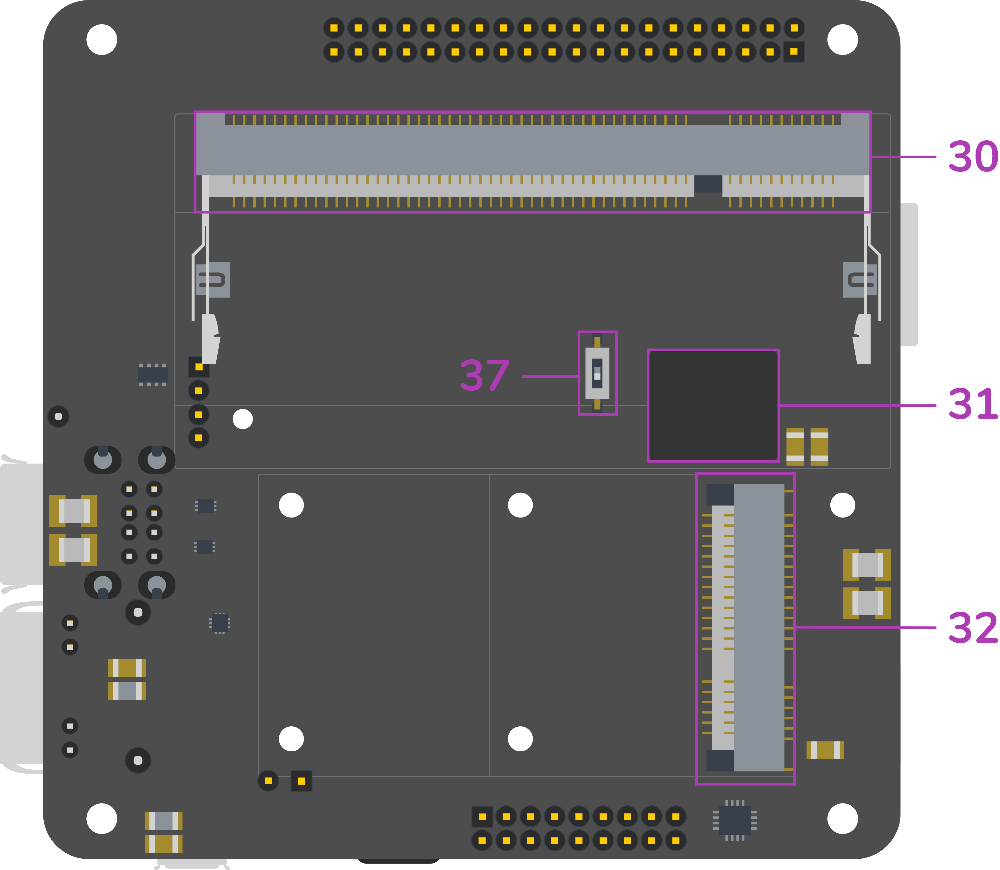
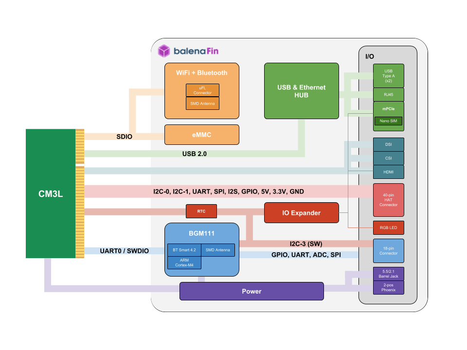
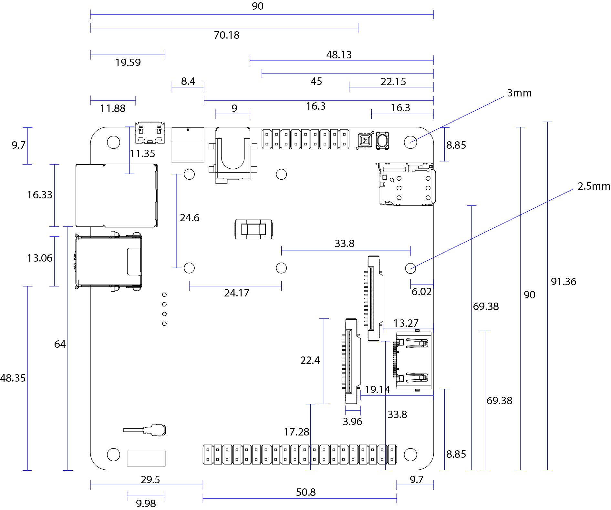
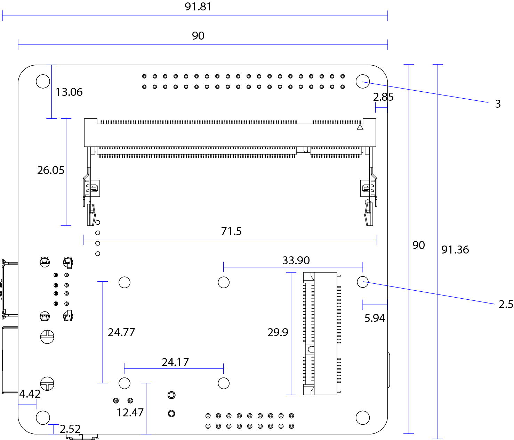

| **Document Type** | Datasheet |
| --- | --- |
| **Product ID:** | BLNFN100001 (20173009) |
| **Product Name** | BalenaFin |
| **Product Version** | 1.1.0 |
| **Manufacturer Part Number** | FIN10001-X (where X is the storage size: 8/16/32/64) |
| **Document Version** | 0.0.2 |
| **Author** | Carlo Maria Curinga |
| **State (Draft/Proposed/Approved)** | Approved |

## Revision history

| **Date (dd/mm/yyyy)** | **Version** | **Author** | **Description** |
| --- | --- | --- | --- |
| 13/02/2019 | 0.0.1 | Carlo Maria Curinga | First draft |
| 21/02/2019 | 0.0.2 | Carlo Maria Curinga | First release |
| 22/02/2019 | 0.0.3 | Carlo Maria Curinga | Update temperature range Minimum value |

# 1. Introduction

BalenaFin is a carrier board for the Raspberry Pi Compute Module 3 Lite and Compute Module 3+ Lite produced by the Raspberry Pi Foundation.

For more information about the Raspberry Pi Compute Module please refer to the following links:

* Datasheet: https://www.raspberrypi.org/documentation/hardware/computemodule/datasheet.md
* Schematics: https://www.raspberrypi.org/documentation/hardware/computemodule/schematics.md

# 2. Availability and Support

Availability of balenaFin in either the current version or a compatible later revision is guaranteed until at least January 2024.

# 3. BalenaFin images and mapping

| Top | Bottom |
| :--------------------------------------------------------: | :--------------------------------------------------------------: |
|  |  |

| **#** | **Name** | **Notes/Description** |
| --- | --- | --- |
| 1 | 5V Status LED | Indicates 5V current flow |
| 2 | 3V3 Status LED | Indicates 3.3V current flow; this is the same as the red LED on the Raspberry Pi 3 Model B |
| 3 | ACT Status LED | CM3L Activity LED; this is the same as the green LED on the Raspberry Pi 3 Model B |
| 4 | SPD Status LED | Ethernet Speed LED; off when in 10-Mbps mode, on when in 100-Mbps mode |
| 5 | FDX Status LED | Ethernet Full-Duplex indicator |
| 6 | LNK Status LED | Ethernet Link/Activity LED |
| 7 | PAN Status LED | If supported by the mPCIE (32) card connected, indicates PAN network activity |
| 8 | LAN Status LED | If supported by the mPCIE (32) card connected, indicates LAN network activity |
| 9 | WAN Status LED | If supported by the mPCIE (32) card connected, indicates WAN network activity |
| 10 | DSI/CAM1 connector | Standard full-size Raspberry Pi MIPI connector that can be configured as Display or secondary Camera (cam1) connector; selection is made via the DSI/CAM1 switch (37) |
| 11 | HDMI | Full-size HDMI Type A with CEC support |
| 12 | CSI connector | Standard full-size Raspberry Pi Camera (cam0) connector |
| 13 | HAT connector | 40-pin Raspberry Pi HAT (Hardware Attached on Top) standard connector |
| 14 | WiFi/BT combo chip | 802.11ac/a/b/g/n 2.4 &amp; 5GHz WiFi + Bluetooth 4.2 |
| 15 | WiFi/BT uFL antenna connector | If the RF switch (33) is set on the external position, the antenna attached to this connector will become the main radio antenna for the WiFi/BT combo chip (14) |
| 16 | WiFi/BT embedded antenna | Embedded high-performance SMD antenna covering both 2.4 and 5GHz frequencies; it is the default antenna selected for the WiFi/BT combo chip (14) |
| 17 | Co-processor | Silicon Labs BGM111 MCU |
| 18 | USB1 ON Status LED | The green LED stays on as long as there is enough current flowing on the top USB port; when this LED is off, it means a fault or under-voltage is happening on the top USB port |
| 19 | USB | 2 x USB Type-A |
| 20 | USB2 ON Status LED | The green LED stays on as long as there is enough current flowing on the bottom USB port; when this LED is off, it means a fault or under-voltage is happening on the bottom USB port |
| 21 | Ethernet | 10/100 ethernet RJ45 connector |
| 22 | PRG - Programming port | micro-USB connector that allows flashing of the eMMC from a host computer using [balenaEtcher](balena.io/etcher) or usbboot. If the device is powered via a cable connected to this port, it will enter a programming mode exposing its eMMC as mass-storage to a host computer (via balenaEtcher or usbboot). __balenaFin can only be booted into flash mode via this port__ |
| 23 | Phoenix power in | Industry standard 2-POS Phoenix type connector for 6-24V input power; polarity is denoted on PCB silkscreen |
| 24 | Barrel Jack power in |  2.1 / 5.5 mm barrel jack type connector for 6-24V input power. Positive polarity (Positive tip, Negative sleeve) - Denoted by symbol on the bottom PCB silkscreen.|
| 25 | Co-Processor I/O connector | 8 x GPIO / ADC, 1 x SPI, 1 x I2C, 1 x Debug UART |
| 26 | CR122 RTC coin-cell battery socket | This allows the embedded RTC to keep track of time while the device is powered off |
| 27 | RGB LED | Connected to a PCA9633 controller that allows standard linux sysfs LED control |
| 28 | USB3 ON Status LED | The green LED stays on as long as there is enough current flowing on the 4-pin header USB port; when this LED is off, it means a fault or under-voltage is happening on the 4-pin header USB port |
| 29 | nano-SIM socket | This allows the use of a wide portfolio of cellular modems via the mPCIe socket (32) |
| 30 | CM3L socket | SODIMM-200 socket for the Raspberry Pi Compute Module 3/3+ Lite |
| 31 | eMMC | 8/16/32/64 GB class 5.1 industrial eMMC - main storage for the CM3L (30). Positioned under the CM3L (30) |
| 32 | mPCIe | Mini PCI Express socket |
| 33 | Antenna switch | 2 position switch - when set to OFF (labeled in silkscreen as "INT"), the WiFi/BT combo chip (14) uses the WiFi/BT embedded antenna (16). When set to ON (labeled in silkscreen as "EXT"), the WiFi/BT combo chip (14) uses the WiFi/BT uFL antenna connector (15) |
| 34 | PoE HAT headers | exposes the incoming voltage from the RJ45 (21) port for PoE HATs that step down and flow 5V to the 5V HAT (13) pins |
| 35 | USB 2.0 4-pin header | Exposes a USB 2.0 port via male headers. pin1 is marked in silkscreen with a triangle |
| 36 | GND probe interface | Exposes a GND probe interface for easy debugging |
| 37 | DSI/CAM1 switch | Switches the full-size Raspberry Pi MIPI connector (10) between Display or secondary Camera (cam1) mode - when set to OFF (labeled in silkscreen as "DISP"), the full-size Raspberry Pi MIPI connector (#10) exposes the DSI (disp1) interface. When set to ON (labeled in silkscreen as "CAM1") the full-size Raspberry Pi MIPI connector (10) exposes the secondary CSI (cam1) interface |
| 38 | POWER IN Fuse (on 23 & 24) | 3A 125VAC/VDC fuse - MPN: 0154003.DR |
| 39 | HAT 5V Fuse | 3A 125VAC/VDC fuse - MPN: 0154003.DR |

## 3.1 HAT connector pinout

| **Pin #** | **Name** | **Notes/Description** | **Pin #** | **Name** | **Notes/Description** |
| --- | --- | --- | --- | --- | --- |
| 1 | 3V3 | 3.3V rail, shared with CM      | 2 | 5V | 5V rail, from regulator |
| 3 | I2C1_SDA | Compute Module I2C1 Data  | 4 | 5V | 5V rail, from regulator |
| 5 | I2C1_SCL | Compute Module I2C1 Clock | 6 | GND | Ground |
| 7 | GPIO4 |  Compute Module GPIO_4       | 8 | GPIO14 | Compute Module GPIO_14 |
| 9 | GND | Ground                         | 10 | GPIO15 | Compute Module GPIO_15 |
| 11 | GPIO17 | Compute Module GPIO_17     | 12 | GPIO18 | Compute Module GPIO_18 |
| 13 | GPIO27 | Compute Module GPIO_13     | 14 | GND | Ground |
| 15 | GPIO22 | Compute Module GPIO_22     | 16 | GPIO23 | Compute Module GPIO_23 |
| 17 | 3V3 | 3.3V rail, shared with CM     | 18 | GPIO24 | Compute Module GPIO_24 |
| 19 | GPIO10 | Compute Module GPIO_10     | 20 | GND | Ground |
| 21 | GPIO9 |  Compute Module GPIO_9      | 22 | GPIO25 | Compute Module GPIO_25 |
| 23 | GPIO11 | Compute Module GPIO_11     | 24 | GPIO8 | Compute Module GPIO_8 |
| 25 | GND | Ground                        | 26 | GPIO7 | Compute Module GPIO_7 |
| 27 | I2C0_SDA | Compute Module I2C0 Data | 28 | I2C0_SCL | Compute Module I2C0 Clock |
| 29 | GPIO5 |  Compute Module GPIO_5      | 30 | GND | Ground |
| 31 | GPIO6 |  Compute Module GPIO_6      | 32 | GPIO12 | Compute Module GPIO_12 |
| 33 | GPIO13 | Compute Module GPIO_13     | 34 | GND | Ground |
| 35 | GPIO19 | Compute Module GPIO_19     | 36 | GPIO16 | Compute Module GPIO_16 |
| 37 | GPIO26 | Compute Module GPIO_26     | 38 | GPIO20 | Compute Module GPIO_20 |
| 39 | GND | Ground                        | 40 | GPIO21 | Compute Module GPIO_21 |  

## 3.2 Silicon Labs BGM111 connector pinout

| **Pin #** | **Name** | **Notes/Description** | **Pin #** | **Name** | **Description** |
| --- | --- | --- | --- | --- | --- |
| 1 | MCU_GPIO0 | Co-processor GPIO_0        | 2 | 3V3 | 3.3V rail, from regulator |
| 3 | MCU_GPIO1 | Co-processor GPIO_1        | 4 | SPI_MCU_CS-CON_EXT |  |
| 5 | MCU_GPIO2 | Co-processor GPIO_2        | 6 | SPI_MCU_CS-SCLK_EXT |  |
| 7 | MCU_GPIO3 | Co-processor GPIO_3        | 8 | SPI_MCU_CS-MOSI_EXT |  |
| 9 | MCU_GPIO4 | Co-processor GPIO_4        | 10 | SPI_MCU_CS-MISO_EXT |  |
| 11 | MCU_GPIO5 | Co-processor GPIO_5       | 12 | DBG_uP-RX_DEV-TX_EXT |  |
| 13 | MCU_GPIO6 | Co-processor GPIO_6       | 14 | DBG_uP-TX_DEV-RX_EXT |  |
| 15 | MCU_GPIO7 | Co-processor GPIO_7       | 16 | MCU_GPIO8 | Co-processor GPIO_8  |
| 17 | GND | Ground                          | 18 | MCU_GPIO9 | Co-processor GPIO_9  |

# 4. Block diagram

# 5. Mechanical specifications (mm)

| Top | Bottom |
| :--------------------------------------------------------: | :--------------------------------------------------------------: |
|  |  |

# 6. General specifications

| **Parameter** | **Minimum** | **Typical** | **Maximum** | **Conditions** |
| --- | --- | --- | --- | --- |
| Power input via power connectors | 6V | - | 24V | 12.5W |
| Power input via HAT connector | 5V | 5V | 5V | 12.5W |
| Operation temperature | -25 celsius | - | 70 celsius |   |

# 7. Radio specifications

### 7.1 Frequency range

| **Description** | **Min.** | **Typ.** | **Max.** | **Unit** |
| --- | --- | --- | --- | --- |
| 11b / g / n (HT20/HT40) | 2412 | - | 2472 | MHz |
| 11a / ac (HT80) | 5180 | - | 5825 | MHz |
| BT / BLE (main) | 2402 | - | 2480 | MHz |
| BT / BLE (secondary, co-processor) | 2400 | - | 2483.5 | MHz |

### 7.2 TX Output Power

| **Description** | **Min.** | **Typ.** | **Max.** | **Unit** |
| --- | --- | --- | --- | --- |
| 11b/11g/11n-2G(20TH/40TH) | 10 / 10 / 10 | 12 / 12 / 12 | 14/ 14/ 14 | dBm |
| 11a/11n-5G20TH/40TH/11ac | 10 / 10 / 8 / 6 | 12 / 12 / 10 / 8 | 14 / 14 / 12 / 10 | dBm |
| BT / BLE (main) | -6 | 0 | 4 | dBm |
| BT / BLE (secondary, co-processor) | -26 | - | 8 | dBm |

### 7.3 RX Sensitivity

| **Description** | **Min.** | **Typ.** | **Max.** | **Unit** |
| --- | --- | --- | --- | --- |
| 11b/11g/11n-2G(20TH/40TH) | - | -87/-73/-69/-66 | -76 / -65 / -64/-61 | dBm |
| 11a/11n-5G(20TH/40TH)/11ac | - | -71/-68/-65/-57 | -65 / -64/-61 /-51 | dBm |
| BT / BLE (main) | - | -86/-86 | -70 / -70 | dBm |
| BT / BLE (secondary, co-processor) | - | -55.2/-47.2 | - | dBm |

# 8. Certification

| **Certification** | **Country / Region** | **Identifier(s)** |
| --- | --- | --- |
| CE | Europe | RE-18071303 |
| FCC | USA | 2APW6BLN-FN-1-00001 |
| IC | Canada | 24038-BLNFN100001 |
| MIC | Japan | R-208-180131 |
| RCM | Australia | _ongoing_ |
| OFCA | Hong Kong | _ongoing_ |

# 9. Labelling

The end product must be labeled, in a visible area, with the following:

- _Contains FCC ID: 2APW6BLN-FN-1-00001 IC: 24038-BLNFN100001_
- _Contains FCC ID: QOQBGM111 IC: 5123A-BGM111_

# 10. Regulatory Insert

# FCC Compliance Statement (USA)

This device complies with Part 15 rules. Operation is subject to the following two conditions:

**1.** This device may not cause harmful interference, and

**2.** This device must accept any interference received, including interference that may cause undesired operation.

**NOTE:** This equipment has been tested and found to comply with the limits for a Class A digital device, pursuant to part 15 of the FCC Rules. These limits are designed to provide reasonable protection against harmful interference when the equipment is operated in a commercial environment. This equipment generates, uses, and can radiate radio frequency energy and, if not installed and used in accordance with the instruction manual, may cause harmful interference to radio communications. Operation of this equipment in a residential area is likely to cause harmful interference in which case the user will be required to correct the interference at his own expense.

## Non-modification Warning

Any changes or modifications to this device not expressly approved by the party responsible for compliance could void the user's authority to operate this equipment.

## RF Exposure Statement

This equipment complies with FCC/IC radiation exposure limits set forth for an uncontrolled environment and meets the FCC radio frequency (RF) Exposure Guidelines and RSS-102 of the IC radiofrequency (RF) Exposure rules. This equipment should be installed and operated keeping the radiator at least 20cm or more away from person's body.

Cet équipement est conforme aux limites d'exposition aux rayonnements énoncées pour un environnement non contrôlé et respecte les règles les radioélectriques (RF) de la FCC lignes directrices d'exposition dans et d'exposition aux fréquences radioélectriques (RF) CNR-102 de l'IC. Cet équipement doitêtre installé et utilisé en gardant une distance de 20 cm ou plus entre le dispositif rayonnant et le corps

**NOTE:** : This equipment has been tested and found to comply with the limits for a Class B digital device, pursuant to part 15 of the FCC Rules. These limits are designed to provide reasonable protection against harmful interference in a residential installation. This equipment generates, uses and can radiate radio frequency energy and, if not installed and used in accordance with the instructions, may cause harmful interference to radio communications. However, there is no guarantee that interference will not occur in a particular installation. If this equipment does cause harmful interference to radio or television reception, which can be determined by turning the equipment off and on, the user is encouraged to try to correct the interference by one or more of the following measures:

- Reorient or relocate the receiving antenna.
- Increase the separation between the equipment and receiver.
- Connect the equipment into an outlet on a circuit different from that to which the receiver is connected.
- Consult the dealer or an experienced radio/TV technician for help.

# Canadian DOC Compliance Statement

Cet appareil numerique de la classe B est conforme a la norme NMB-003 du Canada. This Class B digital apparatus complies with Canadian ICES-003.

## Industry Canada (IC) Warning

Le present appareil est conforme aux CNR d Industrie Canada applicables aux appareils radio exempts de licence. L exploitation est autorisee aux deux conditions suivantes : (1) appareil ne doit pas produire de brouillage, et (2) l utilisateur de l appareil doit accepter tout brouillage radioelectrique subi, meme si le brouillage est susceptible n compromettre le fonctionnement.

This device complies with Industry Canada license-exempt RSS standard(s). Operation is subject to the following two conditions: 1) This device may not cause interference., 2) This device must accept any interference, including interference that may cause undesired operation of the device.
